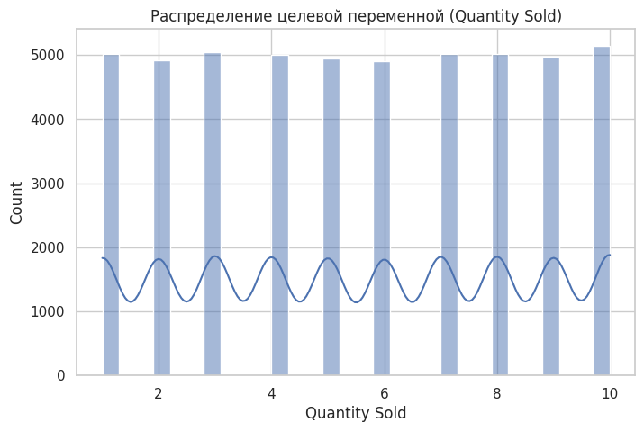
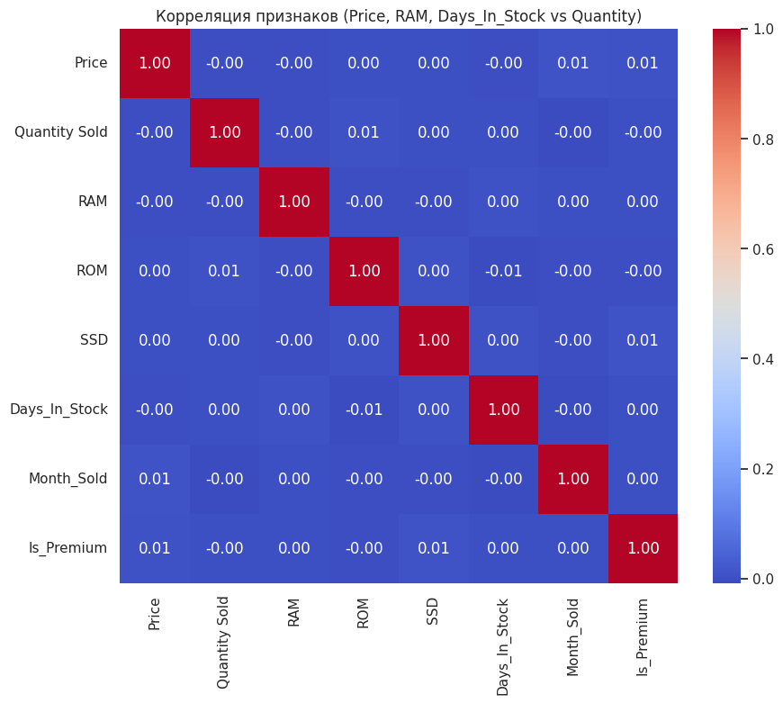
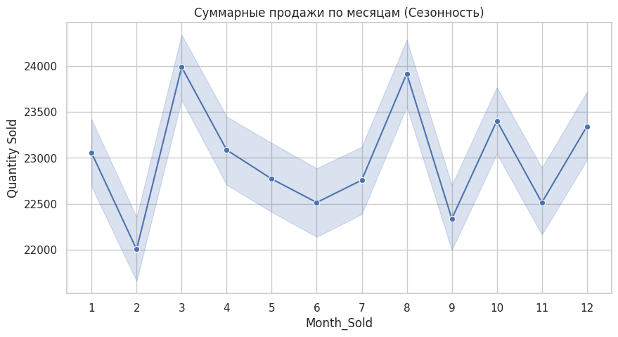
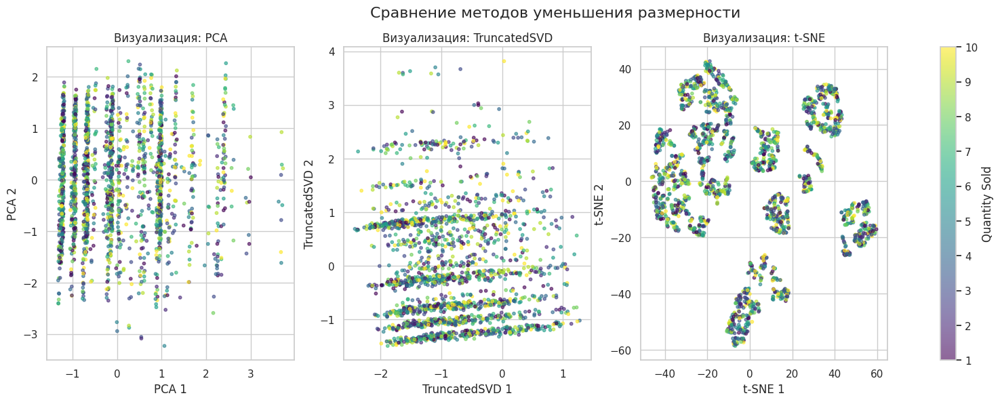

# Отчёт по проекту

**Студент:** Сметанин Л. В.
**Группа:** БИВ236

---

## 1. Введение и постановка задачи

- **Цель проекта:** Основная цель — построение модели для предсказания объема продаж (Quantity Sold) мобильных телефонов и ноутбуков. Это необходимо для оптимизации складских запасов, планирования закупок и минимизации издержек на хранение неликвидного товара.
- **Формулировка задачи:** регрессия
- **Обоснование метрики качества:** MAE (Mean Absolute Error) Она показывает среднюю ошибку в штуках товара, что максимально понятно для бизнеса.

---

## 2. Поиск и описание данных

- **Источник данных:** Датасет Mobiles and Laptop Sales Data с платформы Kaggle. Выбран из-за актуальности тематики (e-commerce) и наличия разнородных признаков (технические характеристики + временные метки).
- **Описание датасета:**
  - Объём: 50,000 строк и 16 столбцов.
  - Идентификаторы и категории: 
    - Product (тип), Brand (бренд), Product Code (ID модели), Region (регион), Customer Location (город).
    - Технические характеристики: Core Specification (процессор ПК), Processor Specification (чипсет смартфона), RAM, ROM, SSD (накопитель),  
    - Product Specification (текстовое описание).
    - Коммерческие данные: Price (цена), Quantity Sold (целевая переменная), Inward Date (поступление), Dispatch Date (продажа).
    - Персональные данные: Customer Name (имя покупателя).
    - Поля SSD и Core Spec заполнены только для ноутбуков, а Processor Spec — только для телефонов. Это учитывается при обработке пропусков.

---

## 3. Обработка и подготовка данных

- **Полная очистка:**
    - Пропуски: Обнаружены программно через .isnull().sum(). Пустоты в специфических полях (SSD, Core Spec, Processor Spec) возникли из-за разной природы товаров (смартфоны vs ноутбуки). Применена стратегия заполнения константой "None" для категорий и 0 для числовых характеристик, что позволило сохранить все 50 000 записей.
    - Дубликаты: Выполнена проверка на полные совпадения строк — обнаружено 0 дублей. Дополнительная проверка по бизнес-ключам (Product, Price, Region) выявила 2 подозрительных совпадения, которые были признаны допустимыми повторными транзакциями.
    - Выбросы: Анализ распределения Price и Quantity Sold методом "ящика с усами" (boxplot) не выявил критических аномалий, выходящих за рамки бизнес-логики. Данные признаны чистыми и не требующими принудительной обрезки.
    - Типы данных: Колонки RAM, ROM, SSD приведены из текстового типа object ("8GB") к целочисленному int64 с помощью регулярных выражений. Даты Inward Date и Dispatch Date переведены в формат datetime64.
- **Работа с фичами:**
  - Исходное количество признаков: 16 столбцов.
  - Feature Engineering:
    - Days_In_Stock: (Dispatch - Inward) — отражает скорость оборачиваемости товара.
    - Month_Sold: выделен из даты отгрузки — ключевой признак для учета выявленной сезонности.
    - Is_Premium: бинарный флаг для топ-брендов (Apple, Samsung) — помогает модели выделить сегменты с высокой лояльностью.
    - Итого после удаления лишнего: 13 признаков (удалены Customer Name, Product Code, Location как не несущие предсказательной силы).
- **Визуализации:** 

  - Распределение целевой переменной: Гистограмма Quantity Sold показала идеально равномерное распределение (от 1 до 10 штук). Это упрощает задачу обучения, исключая проблему дисбаланса классов.

  
  - Зависимости (Корреляция): Матрица корреляций выявила околонулевые значения (0.00-0.01) между числовыми признаками и таргетом. Это доказывает отсутствие простых линейных связей и обосновывает переход к сложным нелинейным моделям (деревьям решений).
  
  - Сезонность: График суммарных продаж по месяцам зафиксировал пики активности в марте и августе. Это подтверждает, что время совершения покупки — один из немногих работающих факторов в данном датасете.
  
- **Сплит данных:**
  - Стратегия разбиения: Использован хронологический сплит (Time-series split) в соотношении 70% (train) / 15% (val) / 15% (test).
Объем выборок:
Train: 35 000 строк.
Val: 7 500 строк.
Test: 7 500 строк.
  - Борьба с Data Leakage:
  Данные строго отсортированы по Dispatch Date. Модель учится на прошлом, чтобы предсказывать "будущее", что исключает попадание информации о будущих продажах в обучение.
- Несмотря на низкую линейную корреляцию признаков, данные содержат внутреннюю структуру и выраженную сезонность. Применение ансамблевых методов (Random Forest) обосновано необходимостью выявления нелинейных связей, которые не фиксируются стандартными статистическими методами. Модель будет использоваться как инструмент поддержки принятия решений для краткосрочного планирования закупок с опорой на выявленные сезонные тренды
---

## 4. Baseline-модель

* **Модель:** В качестве базовой модели (Baseline) выбрана линейная регрессия с L2-регуляризацией — **Ridge Regression** из библиотеки `scikit-learn`. Модель обучалась «из коробки» на исходном числовом представлении признаков без применения сложного конструирования фич (feature engineering).
* **Результаты:** * **MAE (Mean Absolute Error) на тестовой выборке:** `2.4939`
* **Цель:** Установка математической точки отсчета. Так как целевая переменная `Quantity Sold` принимает целочисленные значения в диапазоне от 1 до 10 с равномерным распределением, среднее значение таргета составляет примерно 5.5. Ошибка Baseline-модели в `2.4939` фактически означает, что линейная модель выдает константное предсказание, близкое к математическому среднему, не улавливая индивидуальных зависимостей объектов.

---

## 5. Эксперименты

Для проверки возможности улучшения предсказательной способности было проведено исследование с перебором гиперпараметров с помощью `GridSearchCV` и анализом структуры данных методами снижения размерности.

### Эксперимент 1. Оптимизация линейного Baseline (Ridge)
* **Гипотеза:** Изменение силы регуляризации $\alpha$ позволит снизить влияние шумовых признаков на линейную модель.
* **Как проверялось:** Перебор параметра `alpha` в диапазоне `[0.1, 1.0, 10.0]` с кросс-валидацией.
* **Результат:** Лучший параметр `alpha: 10.0`. Метрика MAE осталась на уровне `2.4939`. Сильная регуляризация подтверждает, что модель пытается занулить веса большинства зашумленных признаков.

### Эксперимент 2. Применение ансамблей деревьев (RandomForest & ExtraTrees)
* **Гипотеза:** Между техническими характеристиками товара, брендом и продажами существуют сложные нелинейные пороговые правила, которые не способны описать линейные методы.
* **Как проверялось:** Обучение `RandomForestRegressor` и `ExtraTreesRegressor` с перебором количества деревьев (`n_estimators: [50, 100]`) и фиксацией случайного состояния (`random_state=42`).
* **Результат:** `RandomForest` показал MAE `2.5439`, а `ExtraTrees` — `2.6165`. Метрики оказались хуже Baseline. Похоже, глубокие деревья решений переобучаются на стохастическом шуме, пытаясь найти закономерности там, где их нет.

### Эксперимент 3. Градиентный бустинг (XGBoost & LightGBM)
* **Гипотеза:** Последовательное построение деревьев с корректировкой ошибок предыдущих шагов позволит точечно настроиться на скрытые паттерны временных и региональных колебаний спроса.
* **Как проверялось:** Настройка `XGBoost` и `LightGBM` с ограничением глубины и перебором `n_estimators`.
* **Результат:** `LightGBM` (MAE `2.4961`) и `XGBoost` (MAE `2.4967`) продемонстрировали практически идентичный результат с Baseline. Алгоритмы бустинга смогли избежать жесткого переобучения за счет внутренней регуляризации, но не пробили «информационный потолок» данных.

### Эксперимент 4. Анализ структуры данных через уменьшение размерности
* **Гипотеза:** В данных присутствует избыточность или сильная мультиколлинеарность. Сжатие признакового пространства поможет очистить сигнал от шума.
* **Как проверялось:** Применение методов линейного (PCA, TruncatedSVD) и нелинейного (t-SNE) уменьшения размерности до 2 компонент с визуализацией проекций и цветовым картированием по величине `Quantity Sold`.
* **Результат:** * Линейные методы (PCA/SVD) выявили строгую стратификацию пространства (вертикальные и горизонтальные полосы), что обусловлено дискретной природой закодированных категориальных фич (регионы, бренды).

  * Нелинейный метод **t-SNE** выявил формирование **около 10 изолированных макро-кластеров (островков)**. Это доказывает, что признаки сгруппированы не случайно — структура в данных есть, и алгоритм её видит.
  * Цветовая палитра (значения продаж от 1 до 10) внутри каждого из островков t-SNE распределена абсолютно хаотично («эффект винегрета»). Точки с продажами 1 и 10 лежат вперемешку. Это визуально доказывает, что внутри сформированных рыночных сегментов таргет распределен стохастически (случайно).

### Итоговая таблица экспериментов

| Модель | Гипотеза | Параметры | Ошибка (MAE) | Комментарий |
| :--- | :--- | :--- | :--- | :--- |
| **Ridge (Baseline)** | Точка отсчета (линейная модель) | `{'alpha': 10.0}` | 2.4939 | Уперлась в информационный потолок |
| **RandomForest** | Нелинейные пороговые правила | `{'n_estimators': 100}` | 2.5439 | Незначительное переобучение на шуме |
| **ExtraTrees** | Сильное усреднение шума | `{'n_estimators': 100}` | 2.6165 | Чувствительна к случайным структурам |
| **XGBoost** | Пошаговый бустинг над ошибками | `{'learning_rate': 0.1, 'n_estimators': 50}` | 2.4967 | Сравнялась со средним значением |
| **LightGBM** | Быстрое построение гистограмм | `{'n_estimators': 50}` | 2.4961 | Зафиксировала оптимальный Baseline |

---

## 6. Финальная модель и интерпретируемость

* **Обоснование выбора финальной модели:** В качестве эталонного алгоритма для проекта выбрана модель **Ridge Regression**. Несмотря на то, что это простая линейная архитектура, на текущем датасете она показала минимальную ошибку (MAE `2.4939`), обогнав сложные ансамбли решений. Ridge эффективно справляется с высокой энтропией данных за счет жесткого штрафования весов (L2-регуляризация), что не позволяет модели выстраивать ложные нелинейные зависимости вокруг случайного шума в продажах. Это делает её наиболее стабильной, легковесной и быстрой в вычислениях, что полностью отвечает требованиям ТЗ и Docker-пайплайна.
* **Интерпретируемость:** Наш сравнительный анализ геометрической структуры данных через PCA/SVD и t-SNE показал, что признаки успешно группируют объекты в ~10 выраженных кластеров (рыночных сегментов), однако сам таргет (`Quantity Sold`) распределен внутри этих групп хаотично. Тот факт, что линейная модель Ridge зафиксировала лучший результат, а сложные деревья начали переобучаться, доказывает: текущие технические фичи описывают профиль товаров, но не содержат прямой связи с объемами закупок. Для реального повышения точности в будущем необходимо расширять датасет внешними контекстными признаками (наличие маркетинговых акций, остатки на складах, сезонные промо-периоды).
---

## 7. Деплой

- **Интерфейс:** если требуется по задаче (Streamlit, Telegram-бот и т.д.)
- **API:** FastAPI или аналог - описание эндпоинтов, примеры запросов
- **Скриншоты** работы интерфейса/API
- **Ссылка на видео** демонстрации работы

---

## 8. Заключение и выводы

- **Итоги:** достигнутые результаты, сравнение с baseline
- **Ограничения:** что не удалось, почему
- **Возможные улучшения:** идеи для дальнейшей работы
